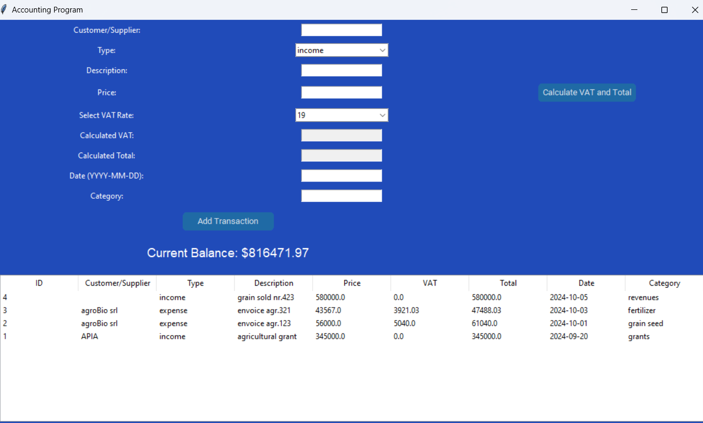
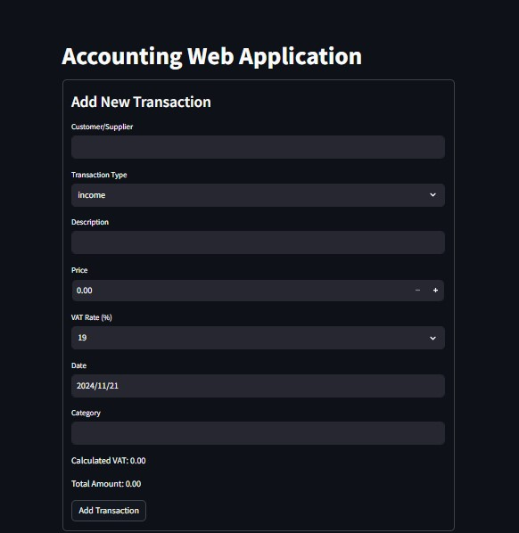
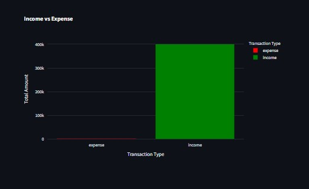

# ACCOUNTING_APP

Note:

> Use this accounting application to record all documents and stay up to date with your company's performance.
  See all your progress inside your database.
  You can use either the Tkinter or Streamlit version, depending on your preference.

#
Important:
```
install these modules for Tkinter version:

pip install tkinter 
pip install sqlite3
pip install customtkinter


And these fot Streamlit:
pip install streamlit 
pip install plotly
pip install sqlite3
pip install pandas
```

Preview:


